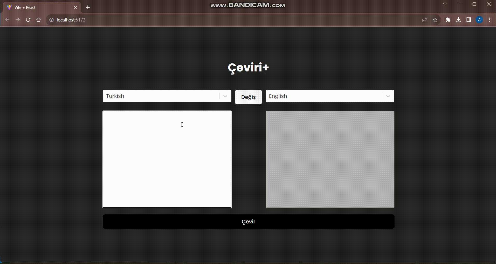

# TRANSLATE APP PROJECT

# USED TECHNOLOGIES:
- React Vite
- SASS
- axios

- Description: The aim of this project is to translate into different languages.

# Libraries:
npm install
- @reduxjs/toolkit
- axios
- react
- react-dom
- react-redux
- react-select
- sass

